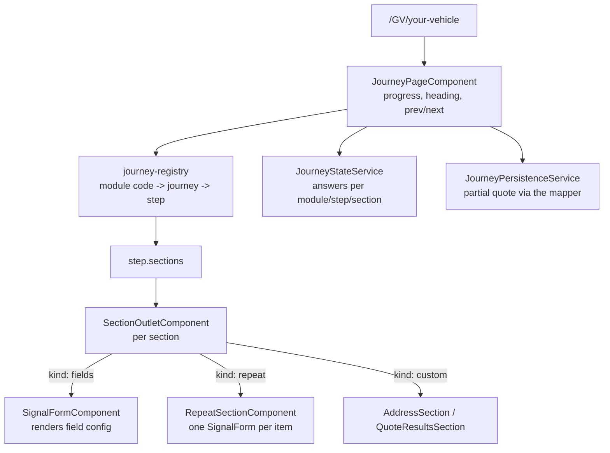

# NG QuickBuy

A multi-brand insurance quote-journey front end. One codebase serves several broker brands
(Quoteline Direct, ChoiceQuote, Arthur J. Gallagher), each selling a different set of insurance
products ("modules") through multi-step question journeys.

Angular 22 · standalone components · signals · zoneless · Tailwind CSS v4 · Vitest

> **Status: work in progress.** The journey and configuration architecture is in place; quote results
> are still demo data and the form runtime is mid-migration. See
> [Known limitations](#known-limitations-and-direction).

## Contents

- [Getting started](#getting-started)
- [Commands](#commands)
- [Core concepts](#core-concepts)
- [How a request becomes a screen](#how-a-request-becomes-a-screen)
- [Journey configuration](#journey-configuration)
- [The form engine](#the-form-engine)
- [Journey state](#journey-state)
- [HTTP, environments and APIs](#http-environments-and-apis)
- [Accessibility](#accessibility)
- [Project layout](#project-layout)
- [Recipes](#recipes)
- [Conventions](#conventions)
- [Troubleshooting](#troubleshooting)
- [Known limitations and direction](#known-limitations-and-direction)

## Getting started

**Prerequisites:** Node 22 LTS or newer (Angular 22 requires `^22.22.3`, `^24.15.0` or `>=26`) and
npm. CI runs Node 22.

```bash
npm install
npm start
```

Then open <http://localhost:4200>.

**Pick a brand.** In a deployed environment the brand comes from the hostname. On `localhost` there
is no brand in the hostname, so the app falls back to `DEFAULT_BRAND_ID` in
`src/app/core/config/dev.config.ts`. Change that constant to develop against another brand — it also
changes which products exist, because a brand only sells the modules it lists.

**Walk a journey.** URLs are `/<MODULE_CODE>/<step-name>`, for example:

- `/PC` — Car Insurance (motor journey)
- `/HC` — House Insurance (property journey)

Visiting `/PC` with no step redirects to the first step. A module the current brand does not sell, or
a step the journey does not have, renders the not-found view.

## Commands

| Command                | Purpose                                                 |
| ---------------------- | ------------------------------------------------------- |
| `npm start`            | Dev server on port 4200                                 |
| `npm run build`        | Production build into `dist/ng-quickbuy`                |
| `npm run watch`        | Development build in watch mode                         |
| `npm test`             | Unit tests in **watch mode** (does not exit)            |
| `npm run test:ci`      | Unit tests once, then exit — use this in scripts and CI |
| `npm run lint`         | ESLint over `src/**/*.ts` and `src/**/*.html`           |
| `npm run format`       | Prettier write                                          |
| `npm run format:check` | Prettier check                                          |

CI (`.github/workflows/ci.yml`) runs lint, `test:ci` and build on every push and pull request.
`format:check` is deliberately not wired in yet: the tree predates Prettier enforcement and needs one
formatting commit first.

## Core concepts

Five nouns explain most of the codebase:

- **Brand** — a broker (`qld`, `chq`, `ajg`). Owns colours, logo, phone number, footer legal text and
  the list of module codes it is allowed to sell.
- **Module** — a product, identified by a short code used as the first URL segment: `PC` car,
  `GV` van, `BD` breakdown, `TX` taxi, `HC` house, `HH` holiday home, `LL` landlord. Defined once in
  `MODULE_CATALOGUE`.
- **Journey** — the questionnaire a module runs. Two exist, `motor` and `property`; several modules
  share one.
- **Step** — one screen of a journey, e.g. `your-details`, `your-vehicle`, `your-quotes`.
- **Section** — one card within a step: `fields` (rendered from field configuration), `repeat` (a list
  of items answering the same questions, such as additional drivers) or `custom` (a bespoke component
  such as address lookup). Answers are stored per section.
- **Slot** — how the APIs identify a person: the customer is `proposer`, and others occupy named slots
  such as `driver-2` or `jointproposer`. The slot list is also the ceiling on how many people a policy
  can name.

Journeys today:

- **motor:** `your-details` → `your-vehicle` → `additional-drivers` → `your-policy` → `your-quotes`
- **property:** `your-details` → `your-property` → `joint-proposer` → `your-policy` →
  `assumptions` → `your-quotes`

## How a request becomes a screen

Routes are lazy-loaded (`src/app/app.routes.ts`):

- `''` → home, the brand's product grid
- `moduleStepMatcher` → `/:moduleCode/:stepName` for any module in the catalogue
- `':moduleCode'` → journey page with no step, which redirects to the first step
- `'**'` → not found

The matcher validates the **module code only**, not the step. Validating the step there would mean
importing every journey definition — and therefore every field schema — into the initial bundle,
which grows with each product. The journey page validates the step and renders the not-found view in
place for one it does not recognise.

There is one screen for every product and step:



`BrandService` resolves the brand once from the hostname and derives the active module code from
router events. Continue validates every visible section, persists what it captured, marks the step
complete and navigates on; one invalid section keeps the customer on the step with errors revealed.

## Journey configuration

**`src/app/core/config/module-catalogue.ts`** is the single source of truth for what a module code
means and which journey it runs. Nothing else maps codes to journeys.

**`src/app/features/modules/journeys/`** holds the journey definitions:

- `motor.journey.ts`, `property.journey.ts` — the steps of each journey, each with its route slug,
  display name, icon, backend `storeStep` id and sections. Ordering comes from list position, so
  there are no `next`/`prev` links to keep in sync.
- `journey-registry.ts` — the only lookup API: resolve a journey for a module, find a step, get the
  next/previous step, list question steps. Returns `null` for an unknown module rather than guessing.

**`src/app/features/modules/specific-modules/config/`** holds field schemas per journey and step
(`motor/steps/*.fields.ts`, `property/steps/*.fields.ts`) plus `shared/common.ts` for the address
schemas, demo quotes and helpers. Each file exports a plain array; journey definitions compose them
into sections.

Field `name` values are **internal** (`forenames`, `registration`, `startDate`). They are a UI concern
and never appear on the wire: `journey-payload.mapper.ts` translates them to insurer keys, and coded
values with them, so `coverType: 'comprehensive'` leaves as `policy-cover: 'C'`. Renaming a field is
therefore safe, and a contract change is confined to the mapper.

Every person answers the **same** field names — `forenames`, `employmentStatus`, `occupationCode` —
and the mapper decides whose they are. Repeat items take their slot from position (`repeatSlots`), and
a section that belongs to a named person declares it (`sectionSlots`), which is what turns the joint
proposer's `surname` into `jointproposer-name-surname` rather than overwriting the customer's.

`shared/occupation.fields.ts` is the one definition of the occupation questions. The proposer, each
additional driver and the joint proposer all call `createOccupationFields()`, differing only in
whether a limited company is offered, whether a second job is asked about, and what gates the whole
set. Occupation is not a bespoke section: it is ordinary field configuration.

## The form engine

`FormFieldConfig` (`src/app/core/models/form-field.model.ts`) is the contract. A field declares its
type, label, help text, options, validators, normalization rules and conditional visibility:

```ts
{
  type: 'text',
  label: 'Joint proposer surname',
  name: 'surname',
  validators: [{ type: 'required' }, { type: 'maxLength', value: 40 }],
  visibleWhen: [{ field: 'hasJointProposer', operator: 'equals', value: 'yes' }],
  normalization: ['trim'],
  metadata: { placeholder: 'Taylor' },
}
```

Two field types are not plain inputs:

- **`autocomplete`** is a search box whose answer is a whole `AutocompleteOption` (`{ code,
description }`), not the text in the box. It names a backend with
  `metadata.autocompleteConfig.endpoint`, which `AutocompleteSourceService` resolves to a real
  service. Typed text that matched nothing leaves the value `null`, so `required` rejects it — a
  match is never chosen on the customer's behalf.
- **`derived`** is not a question at all. It has no control, no node in the field tree and no key in
  the model; its `derived.from(values)` runs whenever the section is read. Use it when one insurer
  key can be answered several ways, so the value is recomputed rather than stored and cannot go
  stale when the customer changes their mind. `derived.toAnswers` is the inverse, used by recall to
  rebuild the answers behind a code.

```ts
{
  type: 'derived',
  label: 'Occupation code',
  name: 'occupationCode',
  derived: {
    from: values => occupationCodeFor(values),
    toAnswers: (code, values) => ({ occupation: { code, description: '' } }),
  },
}
```

The runtime is **Angular Signal Forms** (`@angular/forms/signals`):

- `core/forms/signal-forms-schema.ts` translates `FormFieldConfig` into a Signal Forms schema at
  runtime. It is the only place that casts, because validator signatures expect concrete types that a
  configuration-driven model cannot promise. Conditions become `hidden`/`disabled` logic that
  re-evaluates itself, and existing `ValidatorFn`s are bridged rather than rewritten.
- `shared/components/signal-form/` renders a section from that schema, binding `[formField]` per
  field type and exposing `collect()` for the journey shell.
- `FormNormalizationService` still applies trim/uppercase/phone/date/currency coercion on blur.
- `FormValidationMessageService` supplies wording for rules with no configured message, keyed by
  Signal Forms error kind.

Cross-field and domain validators live in `src/app/core/validators/form-validators.ts`
(`validDateValidator`, `adultOnlyValidator`, `licenseYearsByAgeValidator`).

A section gate is separate from field-level conditions: `JourneySection.visibleWhen` receives the
whole step's answers, which is how the proposer questions stay hidden until an address is resolved.

Things to know before extending it:

- **Rules may only reference fields of their own section.** Reading a path outside the model throws in
  Signal Forms, so the adapter resolves siblings against the section's field names and returns `null`
  otherwise. `licenseYearsByAgeValidator` is in that position — it wants the date of birth, owned by
  the proposer section — so it is currently inert. That is an underwriting gap, not a style issue.
- **Hidden and disabled fields drop out of validity**, so a question the customer never saw cannot
  block a step. Their answers stay in the model, so going back restores them, and anything the
  insurer sees is derived from the current answers rather than read from a field that may be stale.
- **A section's fields may depend on the module.** `JourneyFieldsSection.fields` and
  `JourneyRepeatSection.itemFields` accept either an array or `(moduleCode) => array`, resolved
  through `resolveFields()`. Several products share one journey, and only a van may be held by a
  limited company; this expresses that without duplicating a journey.
- **Element ids are scoped to the rendered section**, because a repeat section renders the same field
  configuration once per item and duplicate ids break both `<label for>` and AXE. Tests should match
  on the `data-field` attribute, which is stable.
- **Repeating groups use a `repeat` section**, which declares the questions asked of each item and the
  wire slots they occupy. Slots are assigned by position, so removing an item re-packs the rest, and
  the number of slots is the maximum number of items. Each item is rendered by the ordinary field
  renderer. Cross-item rules would need the items to share one field tree via `applyEach`.
- **Radio values arrive as strings**, because the native binding reads `element.value`.
- The directive owns `disabled`, `required` and `pattern`, so those cannot be bound directly on a
  `[formField]` host.

## Journey state

`JourneyStateService` stores answers per **module → step → section**, plus which steps are complete.
Nothing is merged into one flat object, so two steps may legitimately use the same field name without
one overwriting the other — `declarationAccepted` genuinely exists in two steps and used to collide.

Answers are also saved server-side as a **partial quote**, so an abandoned journey is recoverable:

- `JourneySessionService` mints a `crypto.randomUUID()` session id on journey entry and persists it,
  with the quote reference, in `sessionStorage`. A reload or deep link therefore continues the same
  partial rather than starting a second one. Neither value is personal data.
- `JourneyPersistenceService` calls `POST /api/miscellaneous/quote/post/store` twice over: a **create**
  on journey entry (no `reference`, returns one) and an **update** after each completed step (with the
  reference, so the backend updates that partial). It honours `quotes_partial_store`, is idempotent per
  session, and never interrupts the customer — failures are logged and a failed create is retried on
  the next completed step.
- The policy start date is required on every call but only asked at step 4, so earlier calls send
  today's date via `ClockService`. Nothing reads `new Date()` directly.
- Every field goes through the product's `JourneyPayloadMapper`, so what is stored server-side uses
  insurer keys and coded values, not the internal names the forms use.

What is still missing is _resume_: reading a partial back needs the recall entry point, and the
identity fields required for it are an open question with the backend.

## HTTP, environments and APIs

Environment files carry per-target configuration:

- `src/environments/environment.ts` — used by default
- `src/environments/environment.production.ts` — swapped in by `fileReplacements` in `angular.json`
- `src/environments/environment.model.ts` — the `AppEnvironment` shape both must satisfy, so a
  divergence is a compile error rather than a runtime surprise

`APP_DOMAIN` is resolved at **runtime** from the hostname, not baked into the build, because one build
serves every brand and the brand is itself derived from the hostname. It is reduced to the bare domain
label the APIs expect, with subdomains and the public suffix removed: both
`quickbuyv3-dev.quotelinedirect.co.uk` and `quotelinedirect.co.uk` resolve to `quotelinedirect`, and
`ajg.com` to `ajg`. `environment.domainOverride` stands in for the hostname during local development,
where `localhost` carries no brand; it is empty in production.

`API_BASE_URL` (`src/app/core/config/api.config.ts`) is injected wherever a service needs the host;
no service hardcodes a URL. `apiInterceptor` (`src/app/core/http/api.interceptor.ts`) applies a
20-second timeout and converts every failure into an `ApiError` with a customer-safe message. There
is no retry yet.

Services and endpoints:

- `AddressLookupService` — `GET /api/miscellaneous/address/get/bypostcode`, used by the address
  section with a manual-entry fallback
- `ModuleParametersService` — `GET /api/module/get/parameters`, wrapped by `ModuleContextService`,
  which loads it once per module and de-duplicates concurrent callers. It exposes the operational
  switches the journey must respect: `system.switchedoff` replaces the journey with an unavailable
  message, `quotes.quotes_partial_store` gates partial storing, and
  `quotes.quotes_allow_buyonline`/`switches.cpd_buyonline_suppressed` are available for buy-online.
- `QuotePartialStoreService` — `POST /api/miscellaneous/quote/post/store`, see
  [Journey state](#journey-state).
- `OccupationSearchService` — `GET /api/occupation/{occupations,employers}/get/{bysearch,bycode}`,
  reached through `AutocompleteSourceService` rather than directly, so an `autocomplete` field names
  an endpoint in configuration and the renderer stays unaware of what is being searched.
- `QuoteRecallService` — `POST /api/quote/get/recall/`, with `QuoteRecallHydrationService` mapping a
  response onto journey sections. Implemented and tested, but **not yet wired into a screen**.

> The production `apiBaseUrl` still points at the development host, marked with a TODO. It must be
> replaced before any production release.

## Accessibility

The bar is WCAG AA and clean AXE checks. `angular-eslint`'s template accessibility rules run in
`npm run lint`, so regressions fail CI.

In place: radio groups named by a real `<legend>`; exactly one label per checkbox/toggle; per-field
polite live regions for validation messages; single `banner` and `contentinfo` landmarks; a skip link
to `<main id="main-content">`; and focus moved to the step heading with a polite "Step _n_ of _m_"
announcement on step change.

Search fields follow the ARIA combobox pattern: arrow keys, `Home`, `End`, `Enter` and `Escape`;
`aria-activedescendant` rather than moving focus; `aria-busy` while searching; and a polite status
region announcing how many matches there are, or why none appeared. Control ids are scoped per
rendered section so a list of three drivers cannot emit the same id three times.

Still open: there is no error summary, so an invalid step reveals per-field errors without moving
focus. Journey step links are not gated on completion, so a later step can be opened before earlier
ones are answered — the progress list does now mark completed steps.

## Project layout

```
src/app/
  core/                          cross-cutting, no UI
    config/                      brands, module catalogue, dev fallback, API and domain tokens
    forms/                       field config -> Signal Forms schema adapter
    http/                        interceptor and ApiError
    models/                      shared types incl. journey and payload contracts
    services/                    brand, journey state, journey session, module context, clock,
                                 normalization, validation messages, HTTP clients
    validators/                  reusable ValidatorFn implementations
  features/
    home/                        brand product grid
    modules/
      journeys/                  journey definitions, registry, payload mappers, persistence
      journey-page/              the journey screen
        section-outlet.component.ts   maps a section to its renderer
        sections/                     address, repeat and quote-results sections
      specific-modules/
        components/              address search
        config/                  field schemas per journey and step
          lookups/               shared option lists, such as employment statuses
          shared/                field factories reused by every person, such as occupation
        services/                quote recall hydration
  shared/components/             signal-form, autocomplete-input, step-card, header, footer,
                                 not-found
src/environments/                per-target configuration
```

`core` must not import from `features`. `shared` holds reusable presentation only.

## Recipes

### Add a field to an existing step

1. Add a `FormFieldConfig` entry to the relevant
   `specific-modules/config/<journey>/steps/*.fields.ts`.
2. Give `name` a readable internal value (`annualMileage`, not `policy-totalmileage`).
3. If the insurer expects a different key, add the mapping to `journey-payload.mapper.ts`. Without one
   the field is sent under its internal name, which is fine only while that name matches the contract.
4. If it needs a starting value, add it to that section's `defaults` in the journey definition.
5. For a bespoke rule, add a `ValidatorFn` to `core/validators/form-validators.ts` and reference it as
   `{ type: 'custom', name: '...', validatorFn: ..., message: '...' }`. Note it can only read siblings
   in the same section.

No component changes are needed.

### Add a step to a journey

1. Add the field schema in `specific-modules/config/<journey>/steps/<step>.fields.ts`.
2. Add a step entry to `journeys/<journey>.journey.ts` in the position it should appear, with its
   `name`, `displayName`, `icon`, `storeStep` and sections.

That is the whole change: ordering, routing, progress display, prev/next and validation all follow
from the definition.

### Add a list of items, such as extra drivers

1. Add the per-item questions as their own `FormFieldConfig` array.
2. Add a `repeat` section to the step with `itemFields`, an `itemLabel`, and the wire `slots` items may
   occupy. The number of slots is the maximum number of items, so take it from the insurer's allowed
   list rather than writing a number.
3. Register those slots against the section id in the product's mapper (`repeatSlots`), so items are
   filed under the right keys.

Slots are assigned by position, so removing an item re-packs the rest.

### Add a searchable field

1. Add a `search`/`describe` pair to `AutocompleteSourceService` under a new endpoint key.
2. Add an `autocomplete` field naming that key in `metadata.autocompleteConfig.endpoint`.
3. Its answer is an `AutocompleteOption`, which is UI state. Add the field name to `UI_ONLY_FIELDS`
   in the mapper and send the code through a `derived` field, so the wording the customer read
   never reaches the insurer.

### Add a section with bespoke UI

Prefer field configuration: a custom section cannot be reused by another person on the policy, and
occupation was one until it became a `createOccupationFields()` call. Reach for this only when the
generic renderer genuinely cannot draw the UI, as with address lookup.

1. Write the component under `journey-page/sections/`, exposing
   `collect(): { valid: boolean; values: Record<string, unknown> }` and writing its values to
   `JourneyStateService`.
2. Add a `@case` for its key in `section-outlet.component.ts`.
3. Reference it from a step as `{ kind: 'custom', id: '...', component: '<key>' }`.

### Add a module (product)

1. Add an entry to `MODULE_CATALOGUE` with its description, icon and `journeyId`.
2. Add the code to `moduleCodes` for each brand that sells it in `brands.config.ts`.

### Add a brand

1. Extend the `BrandId` union in `core/models/brand.model.ts`.
2. Add the brand entry, including its `moduleCodes`, in `core/config/brands.config.ts`.
3. Add a hostname match in `detectBrand()` in `core/services/brand.service.ts`.
4. Add the logo under `public/img/logos/<brand>/`.

## Conventions

- `AGENTS.md` is the single source of truth for coding standards. `.claude/CLAUDE.md`,
  `.github/copilot-instructions.md` and `.junie/guidelines.md` are symlinks to it — edit `AGENTS.md`
  only.
- TypeScript runs with `strict`; templates with `strictTemplates` and `typeCheckHostBindings`.
- Signals first: `input()`/`output()` functions rather than decorators, `computed()` for derived
  state, `viewChild()`/`viewChildren()` rather than decorators, `inject()` rather than constructor
  injection.
- Forms use Signal Forms. Note `form()` registers an effect internally, so it cannot be created
  inside a `computed()` — build field trees in `ngOnInit` or the constructor.
- Native control flow (`@if`, `@for`, `@switch`); `class`/`style` bindings rather than `ngClass`/`ngStyle`.
- Do not set `standalone: true` or `changeDetection: OnPush` explicitly; both are defaults now.
- The app is **zoneless** — there is no `zone.js`. Anything relying on automatic change detection
  from monkey-patched async APIs will not work; use signals.
- Icons are Font Awesome **solid only**, self-hosted. Use existing `fa-solid fa-*` class names.

## Troubleshooting

**`npm test` never finishes.** That is watch mode. Use `npm run test:ci`.

**A module URL 404s.** The brand must sell that module. On localhost the brand comes from
`DEFAULT_BRAND_ID` in `dev.config.ts`; `ajg`, for instance, only sells `GV`, `TX` and `HC`, so `/PC`
legitimately 404s under that brand. A URL such as `/GV/not-a-step` also shows not-found, because the
journey has no such step.

**Wrong brand colours or logo locally.** Same cause: change `DEFAULT_BRAND_ID`.

**Icons render as empty boxes.** Icon classes are built by string interpolation, and one comes from
the module-parameters API. Font Awesome is pinned to `^6.7.2` on purpose: v7 removes the v5-era
aliases this app uses (`fa-file-alt`, `fa-user-edit`, `fa-check-square`, `fa-home`). Only the solid
face ships, so a `fa-brands` or `fa-regular` name will not resolve until its stylesheet is added to
`angular.json`.

**Answers disappear after a reload.** Client-side journey state is in-memory, so the screen restarts.
The answers are not lost server-side — a partial quote was stored and the session id and reference
survive in `sessionStorage` — but nothing reads the partial back yet, so there is no visible resume.

**A template error appears that the editor did not show.** `strictTemplates` is on; run
`npm run build` for the authoritative diagnostics.

## Known limitations and direction

Deliberate, known gaps — check here before assuming something is a bug:

1. **No cross-item validation.** A `repeat` section renders one form per item, so a rule spanning
   items — rejecting two drivers with the same date of birth, say — cannot be expressed. `applyEach`
   would give the items a shared field tree when that is needed.
2. **The mapper's key coverage is partial.** Every product has a versioned mapper owning the
   translation, but a field with no confirmed insurer key is sent under its internal name. Those are
   the names to check against the backend contract: `vehicleUse`, `hasAdditionalDrivers`,
   `hasJointProposer`, `licenseYearsHeld`, `declarationAccepted`, `propertyType`, `bedrooms`,
   `occupancy`, `yearBuilt`, `buildingsSumInsured` and `contentsSumInsured`. The occupation keys
   (`*-employmentstatus`, `*-occupationcode`, `*-industrycode` and their `pt-` counterparts) are
   also unconfirmed and carry a TODO in the mapper.
3. **No resume entry point.** Partial quotes are saved, but nothing reads one back yet: the recall
   service and its hydration are implemented and unwired, pending confirmation of which identity
   fields are required and how the customer receives the reference. A browser refresh therefore still
   restarts the journey visually even though the partial exists server-side.
4. **`storeStep` values are provisional.** Each step carries a backend step identifier, currently
   mirroring its route slug, pending the real values — including what the create call should send,
   since it fires before any step is complete.
5. **Buy-online switches are read but unused.** `allowsBuyOnline()` exists; no screen consumes it yet,
   because there is no buy-online step.
6. **No step-order gating.** Any step can be opened directly from the progress list, regardless of
   whether earlier steps are complete.
7. **Demo quotes.** The final step renders fixture data and a payload dump, not live pricing.
8. **Recall does not rebuild list items.** Hydration walks `fields` sections only, so a recalled
   quote restores the customer and the joint proposer but not additional drivers; the driver keys
   land in `unresolvedFields`, which is where to look when wiring resume.
9. **Occupation search needs four characters.** The backend's minimum, so short job titles such as
   "vet" cannot be found by typing them alone. The field says so rather than appearing broken, but
   it is a real gap to raise with the backend.
