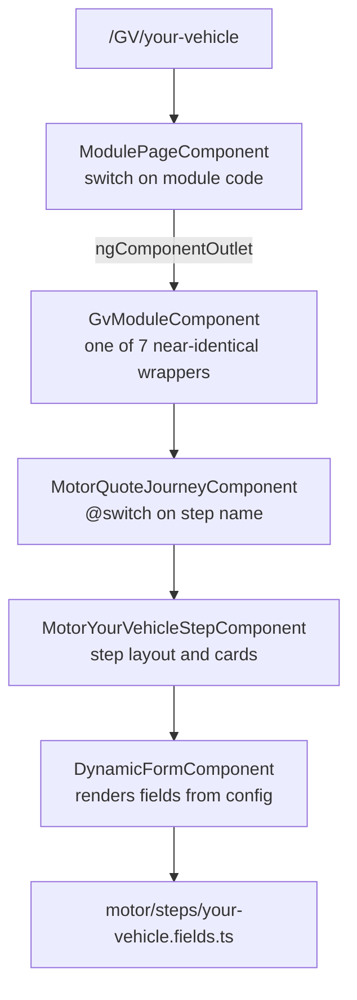

# NG QuickBuy

A multi-brand insurance quote-journey front end. One codebase serves several broker brands
(Quoteline Direct, ChoiceQuote, Arthur J. Gallagher), each selling a different set of insurance
products ("modules") through multi-step question journeys.

Angular 22 · standalone components · signals · zoneless · Tailwind CSS v4 · Vitest

> **Status: work in progress.** The end-to-end UX and architecture are proven; quote results are
> still demo data. Parts of the journey layer are actively being restructured — read
> [Known limitations](#known-limitations-and-direction) before designing anything new on top of it.

## Contents

- [Getting started](#getting-started)
- [Commands](#commands)
- [Core concepts](#core-concepts)
- [How a request becomes a screen](#how-a-request-becomes-a-screen)
- [Configuration layers](#configuration-layers)
- [The form engine](#the-form-engine)
- [Journey state](#journey-state)
- [HTTP, environments and APIs](#http-environments-and-apis)
- [Accessibility](#accessibility)
- [Project layout](#project-layout)
- [Recipes](#recipes)
- [Conventions](#conventions)
- [Troubleshooting](#troubleshooting)
- [Known limitations and direction](#known-limitations-and-direction)

## Getting started

**Prerequisites:** Node 22 LTS or newer (Angular 22 requires `^22.22.3`, `^24.15.0` or `>=26`) and
npm. CI runs Node 22.

```bash
npm install
npm start
```

Then open <http://localhost:4200>.

**Pick a brand.** In a deployed environment the brand is chosen from the hostname. On `localhost`
there is no brand in the hostname, so the app falls back to `DEFAULT_BRAND_ID` in
`src/app/core/config/dev.config.ts` — currently `ajg`. Change that constant to develop against a
different brand.

**Walk a journey.** URLs are `/<MODULE_CODE>/<step-name>`. With the default `ajg` brand, try:

- `/GV` — Van Insurance (motor journey)
- `/HC` — House Insurance (property journey)

Visiting `/GV` with no step redirects to the first step. A module the current brand does not sell
renders the not-found page — see [Troubleshooting](#troubleshooting) if that surprises you.

## Commands

| Command | Purpose |
| --- | --- |
| `npm start` | Dev server on port 4200 |
| `npm run build` | Production build into `dist/ng-quickbuy` |
| `npm run watch` | Development build in watch mode |
| `npm test` | Unit tests in **watch mode** (does not exit) |
| `npm run test:ci` | Unit tests once, then exit — use this in scripts and CI |
| `npm run lint` | ESLint over `src/**/*.ts` and `src/**/*.html` |
| `npm run format` | Prettier write |
| `npm run format:check` | Prettier check |

CI (`.github/workflows/ci.yml`) runs lint, `test:ci` and build on every push and pull request.
`format:check` is deliberately not wired in yet: the tree predates Prettier enforcement and needs one
formatting commit first.

## Core concepts

Four nouns explain most of the codebase:

- **Brand** — a broker (`qld`, `chq`, `ajg`). Owns colours, logo, phone number, footer legal text
  and, critically, *which modules it may sell*.
- **Module** — a product, identified by a short code used as the first URL segment: `PC` car,
  `GV` van, `BD` breakdown, `TX` taxi, `HC` house, `HH` holiday home, `LL` landlord.
- **Journey type** — the shape of the questionnaire. Two exist, `motor` and `property`. Several
  modules share one journey type.
- **Step** — one screen of a journey, for example `your-details`, `your-vehicle`, `your-quotes`.

Journeys today:

- **motor:** `your-details` → `your-vehicle` → `additional-drivers` → `your-policy` → `your-quotes`
- **property:** `your-details` → `your-property` → `joint-proposer` → `your-policy` →
  `assumptions` → `your-quotes`

## How a request becomes a screen

All four routes are lazy-loaded (`src/app/app.routes.ts`):

- `''` → home, the brand's product grid
- a custom `moduleStepMatcher` → `/:moduleCode/:stepName`, which only matches when the step is valid
  for that module's journey type
- `':moduleCode'` → the module page with no step, which redirects to the first step
- `'**'` → not found

`BrandService` resolves the brand once at construction from the hostname, and derives the active
module code from router events. `App` renders the not-found page when the requested module is not one
the current brand sells.

From there, the module page dispatches through three layers before a single field is rendered:



The module page also owns the journey progress list, the previous/next controls and step-change focus
management. "Next" does not submit the form directly: it publishes a request through
`StepNavigationService`, the active journey component receives it and calls the current step
component, which submits its `DynamicFormComponent`.

> Those three dispatch layers are the main known design problem, not a pattern to copy. Adding a step
> or product currently means editing six to eight files. See
> [Known limitations](#known-limitations-and-direction).

## Configuration layers

Behaviour is config-driven, but configuration lives in two places.

**`src/app/core/config/`** — application-wide:

- `brands.config.ts` — every brand: colours, logo, phone, footer, and its module list
- `module-journeys.config.ts` — the step list per journey type (with `next`/`prev` links), the
  module-code → journey-type map, and the step validation used by the route matcher
- `dev.config.ts` — `DEFAULT_BRAND_ID`, the localhost-only brand fallback

**`src/app/features/modules/specific-modules/config/`** — per journey and step:

- `motor/` and `property/`, each with `step-order.config.ts`, `default-values.config.ts`,
  `modules.ts` (the module codes belonging to that journey) and `steps/*.fields.ts`
- `shared/common.ts` — address lookup and manual-entry field schemas, demo quotes, small helpers
- `journey-config.selectors.ts` — resolves a module code plus step name to field schemas and defaults

Field `name` values deliberately mirror backend/recall keys where known
(`proposer-name-forenames`, `vehicle-regnumber`, `policy-inceptiondate`). Legacy camelCase keys are
bridged temporarily through `metadata.aliases`. See `specific-modules/config/README.md` for the
naming strategy.

## The form engine

`FormFieldConfig` (`src/app/core/models/form-field.model.ts`) is the contract. A field declares its
type, label, help text, options, validators, normalization rules and conditional visibility or
enablement:

```ts
{
  type: 'number',
  label: 'How many additional drivers?',
  name: 'additionalDriverCount',
  validators: [{ type: 'min', value: 0 }, { type: 'max', value: 4 }],
  visibleWhen: [{ field: 'hasAdditionalDrivers', operator: 'equals', value: 'yes' }],
  enabledWhen: [{ field: 'hasAdditionalDrivers', operator: 'equals', value: 'yes' }],
  metadata: { placeholder: '1' },
}
```

`DynamicFormComponent` turns an array of these into a flat `FormGroup` and renders the markup,
supported by three services:

- `FormValidationRegistryService` — maps validator config to `ValidatorFn`, including named custom
  validators
- `FormNormalizationService` — trim/uppercase/lowercase/phone/date/currency coercion on blur
- `FormValidationMessageService` — resolves which message to show, preferring the field's own text

Cross-field and domain validators live in `src/app/core/validators/form-validators.ts`
(`validDateValidator`, `adultOnlyValidator`, `licenseYearsByAgeValidator`).

**Limitations to know before extending it:** the model is flat, so repeating groups (multiple
drivers, claims, convictions) cannot be expressed — `additional-drivers` stores a *count* rather than
a list. Changing the `initialValue` input tears down and rebuilds every control, which resets
submitted state and collapses open help panels.

## Journey state

`FormWorkflowService` holds answers in a root-level signal keyed `MODULE:step`, for example
`GV:your-vehicle`. Step components emit their values on submit; the journey component saves them and
navigates on.

Two consequences worth knowing: state is **in-memory only**, so a reload loses the journey; and the
final payload is built by shallow-merging every step's values into one flat object, so a field name
reused across two steps silently overwrites.

## HTTP, environments and APIs

Environment files carry per-target configuration:

- `src/environments/environment.ts` — used by default
- `src/environments/environment.production.ts` — swapped in by the `fileReplacements` entry in
  `angular.json` for the production configuration
- `src/environments/environment.model.ts` — the `AppEnvironment` shape both files must satisfy, so a
  divergence is a compile error rather than a runtime surprise

`API_BASE_URL` (`src/app/core/config/api.config.ts`) is injected wherever a service needs the host;
no service hardcodes a URL. `apiInterceptor` (`src/app/core/http/api.interceptor.ts`) applies a
20-second timeout and converts every failure into an `ApiError` carrying a status and a
customer-safe message. There is no retry yet.

Services and endpoints:

- `AddressLookupService` — `GET /api/miscellaneous/address/get/bypostcode`, used by the address step
  with a manual-entry fallback
- `ModuleParametersService` — `GET /api/module/get/parameters`, currently consumed only by the header
  for the module title and phone number. The response also carries opening hours, PDF links and
  operational kill switches (`system.switchedoff`, `quotes.quotes_allow_buyonline`,
  `switches.cpd_buyonline_suppressed`) that nothing acts on yet.
- `QuoteRecallService` and `QuoteRecallHydrationService` — implemented and unit-tested, but **not yet
  wired into any component**

> The production `apiBaseUrl` still points at the development host, marked with a TODO. It must be
> replaced before any production release.

## Accessibility

The bar for this project is WCAG AA and clean AXE checks. `angular-eslint`'s template accessibility
rules run in `npm run lint`, so regressions fail CI.

In place: radio groups named by a real `<legend>`; exactly one label per checkbox/toggle; per-field
polite live regions for validation messages; single `banner` and `contentinfo` landmarks; a skip link
to `<main id="main-content">`; and focus moved to the step heading with a polite "Step *n* of *m*"
announcement on step change (`viewChild` + `afterRenderEffect`, never on first paint).

Still open: there is no error summary, and the page-level "Next" button sits outside the form, so an
invalid step shows per-field errors without moving focus. Journey step links are also not gated on
completion, so a later step can be reached before earlier ones are answered.

## Project layout

```
src/app/
  core/                        cross-cutting, no UI
    config/                    brands, journeys, dev fallback, API token
    http/                      interceptor and ApiError
    models/                    shared types
    services/                  brand, form workflow, normalization, validation, HTTP clients
    validators/                reusable ValidatorFn implementations
  features/
    home/                      brand product grid
    modules/
      module-page.*            journey chrome: progress, prev/next, step focus
      specific-modules/
        components/            per-module wrappers, journey dispatchers, address search
        config/                journey, step and field configuration
        services/              quote recall hydration
        steps/                 per-step layouts
  shared/components/           dynamic-form, step-card, header, footer, not-found
src/environments/              per-target configuration
```

`core` must not import from `features`. `shared` holds reusable presentation only.

## Recipes

### Add a field to an existing step

1. Add a `FormFieldConfig` entry to the relevant
   `specific-modules/config/<journey>/steps/*.fields.ts`.
2. Use the backend key as `name` where it is known; add `metadata.aliases` only when migrating off a
   legacy key.
3. Add a matching entry to that journey's `default-values.config.ts` if the step needs a default.
4. For a bespoke rule, add a `ValidatorFn` to `core/validators/form-validators.ts` and reference it
   as `{ type: 'custom', name: '...', validatorFn: ..., message: '...' }`.

No component changes are needed — `DynamicFormComponent` renders whatever the schema declares.

### Add a step to a journey

Currently a multi-file change:

1. `core/config/module-journeys.config.ts` — insert the step and fix the `next`/`prev` links on the
   steps either side of it.
2. `specific-modules/config/<journey>/step-order.config.ts` — add it in the same position.
3. `specific-modules/config/<journey>/steps/<step>.fields.ts` — the field schema, plus an export from
   that journey's `index.ts`.
4. `specific-modules/config/journey-config.selectors.ts` — map the step name to its schema.
5. `specific-modules/steps/form-step.components.ts` — a step component exposing
   `submitFromNavigation()`.
6. `specific-modules/components/quote-journeys.component.ts` — a `@case` in the template, a view
   query for the new step component, and a branch in `submitCurrentStep()`.

### Add a module (product) to an existing journey type

1. `core/config/brands.config.ts` — add it to each brand that sells it, with its `journeyType`.
2. `core/config/module-journeys.config.ts` — add the code to `MODULE_JOURNEY_TYPE_BY_CODE`.
3. `specific-modules/config/<journey>/modules.ts` — add the code, then extend the per-module maps in
   that journey's `steps/*.fields.ts` and `default-values.config.ts`.
4. `specific-modules/components/brand-modules.component.ts` — a wrapper component, exported from
   `specific-modules/index.ts`.
5. `features/modules/module-page.ts` — a `case` in `moduleComponent()`.

### Add a brand

1. `core/models/brand.model.ts` — extend the `BrandId` union.
2. `core/config/brands.config.ts` — the brand entry, including its module list.
3. `core/services/brand.service.ts` — a hostname match in `detectBrand()`.
4. Add the logo under `public/img/logos/<brand>/`.
5. Set `DEFAULT_BRAND_ID` in `dev.config.ts` to test it on localhost.

## Conventions

- `AGENTS.md` is the single source of truth for coding standards. `.claude/CLAUDE.md`,
  `.github/copilot-instructions.md` and `.junie/guidelines.md` are symlinks to it — edit `AGENTS.md`
  only.
- TypeScript runs with `strict`; templates with `strictTemplates` and `typeCheckHostBindings`.
- Signals first: `input()`/`output()` functions rather than decorators, `computed()` for derived
  state, `inject()` rather than constructor injection.
- Native control flow (`@if`, `@for`, `@switch`); `class`/`style` bindings rather than `ngClass`/`ngStyle`.
- Do not set `standalone: true` or `changeDetection: OnPush` explicitly; both are defaults now.
- The app is **zoneless** — there is no `zone.js`. Anything relying on automatic change detection
  from monkey-patched async APIs will not work; use signals.
- Icons are Font Awesome **solid only**, self-hosted. Use existing `fa-solid fa-*` class names.

## Troubleshooting

**`npm test` never finishes.** That is watch mode. Use `npm run test:ci`.

**A module URL 404s.** The brand must sell that module. On localhost the brand comes from
`DEFAULT_BRAND_ID` in `dev.config.ts`, which is `ajg` and only sells `GV`, `TX` and `HC` — so `/PC`
legitimately 404s until you switch brand. A URL such as `/GV/not-a-step` also 404s, because the route
matcher validates the step against the journey type.

**Wrong brand colours or logo locally.** Same cause: change `DEFAULT_BRAND_ID`.

**Icons render as empty boxes.** Icon classes are built by string interpolation, and one of them comes
from the module-parameters API. Font Awesome is pinned to `^6.7.2` on purpose: v7 removes the v5-era
aliases this app uses (`fa-file-alt`, `fa-user-edit`, `fa-check-square`, `fa-home`). Do not upgrade to
v7 without renaming those first. Only the solid face ships, so a `fa-brands` or `fa-regular` name will
not resolve until its stylesheet is added to `angular.json`.

**Answers disappear after a reload.** Journey state is in-memory only. Header, footer and 404 links
use `routerLink` so they no longer force a page reload, but a browser refresh still clears everything.

**A template error appears that the editor did not show.** `strictTemplates` is on; run
`npm run build` for the authoritative diagnostics.

## Known limitations and direction

Deliberate, known gaps — check here before assuming something is a bug:

1. **Journey structure lives in components, not data.** Three dispatch layers, seven near-identical
   module wrappers, two near-identical journey components, and module → journey mapping duplicated
   across three config files. Being replaced by a single journey registry plus one generic step host.
2. **No repeatable groups.** The flat form model cannot express multiple drivers, claims or
   convictions. Addressed by moving to a nested typed model and Angular Signal Forms
   (`@angular/forms/signals`), whose `applyEach`/`applyWhen` cover repeatable and conditional sections
   natively.
3. **Flat payload merge.** Step values are shallow-merged, so a name reused across steps collides
   (`declarationAccepted` already exists in two steps). Being replaced by a typed nested model with an
   explicit, versioned payload mapper per product.
4. **No persistence.** Server-side partial-quote save and resume is designed but not built; the recall
   services are already in place for the read side.
5. **Operational switches ignored.** The module-parameters response can switch a product off or
   suppress buy-online; nothing gates the journey on it yet.
6. **Unknown module codes fall back silently.** `asMotorModuleCode()` returns `PC` and
   `asPropertyModuleCode()` returns `HC` for anything unrecognised, so a misconfiguration renders the
   wrong product's questions instead of failing loudly.
7. **Demo quotes.** The final step renders fixture data and a payload dump, not live pricing.
